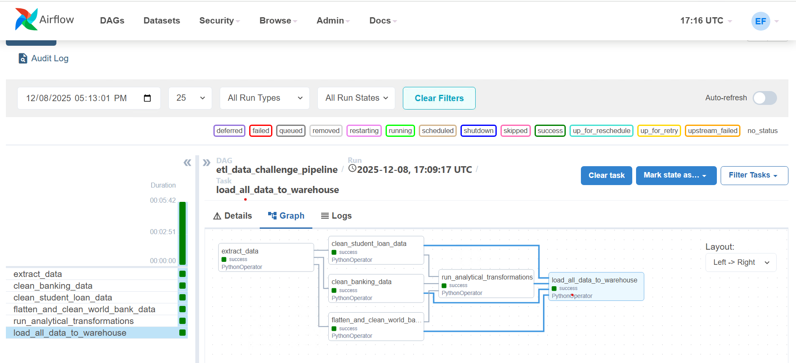
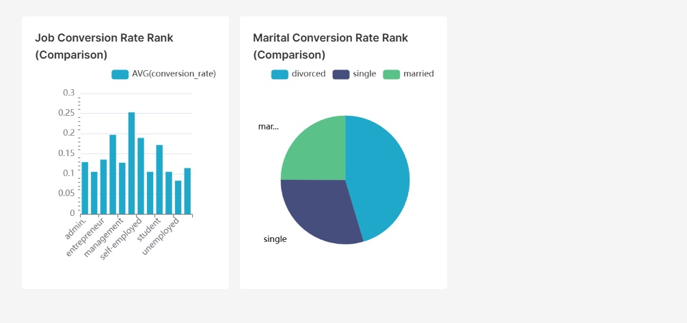

# 🚀 Data Challenge ETL Pipeline
This project implements a robust, automated Extract, Transform, Load (ETL) pipeline using Apache Airflow for orchestration, PostgreSQL for data warehousing (DW), and Apache Superset for analytical reporting.

The pipeline integrates three diverse datasets into a unified Star Schema to enable deep-dive analysis on banking campaign performance, student loans, and global economic indicators.

# 🌟 Key Features
* __Orchestration__: Fully managed by Apache Airflow (DAG de_etl.py).

* __Data Sources__: Integrates CSV and complex Nested JSON files from Kaggle sources.

* __Data Warehouse__: Implements a Star Schema design in PostgreSQL (schema: ml).

* __Analytical Output__: Calculates a key Marketing Conversion Rate metric.

* __Idempotency__: Utilizes TRUNCATE + INSERT logic to ensure pipeline runs are reproducible and reliable.

* __Visualization__: Data is exposed for analysis via Apache Superset.
* __Description__ : PDF file called ETL Pipeline Analysis and Implementation Summary.pdf

# 🛠️ Project Architecture (ELT Stack)
This pipeline follows a modular, dependency-driven architecture.

* __Component__,Role,Files/Implementation
* __Orchestration__, Manages task flow, scheduling, and dependencies.  de_etl.py (Airflow DAG)
* __Extraction (E)__,Reads data from CSVs and Nested JSON . Python/Pandas operators within the DAG.
* __Transformation (T)__, Cleans, standardizes, flattens JSON, and calculates metrics, Parallel Python tasks (clean_*, flatten_*, run_analytical_transformations).
* __Data Warehouse (L)__,Stores the final, analyzed data in a Star Schema,tables.sql, PostgreSQL.
* __Reporting__,Visualizes the report_marketing_metrics table,Apache Superset.

 # 📦 Data Warehouse Schema Design
 The PostgreSQL database is organized using a Star Schema within the ml schema, optimizing for analytical queries and ease of reporting.
 * Fact Tables:
   * ml.fact_banking_campaign
   * ml.fact_indicator_value
   * ml.fact_student_loan
 * Dimension Tables:
   * ml.dim_country
   * ml.dim_indicator
   * ml.dim_school
   * ml.dim_banking_client
  
  __The full Data Definition Language (DDL) for all tables is located in the tables.sql file.__

  # ⚙️ Setup and Installation
  ## Prerequisites
  You'll need the following services running and configured:
   1. __Apache Airflow__: (Webserver, Scheduler, Worker)
   2. __PostgreSQL__: (Data Warehouse)
   3. __Apache Superset__: (For visualization)

1. __Database Setup__
   1. Ensure your PostgreSQL database is accessible.
   2. Connect to the database and execute the DDL script to create the necessary tables and schema:
   3. Ensure the Airflow Connection is configured for PostgreSQL (e.g., using the postgres_default or a dedicated connection ID referenced in the DAG).
2. __Airflow DAG Deployment__
   1.  Place the de_etl.py file into your Airflow DAGs folder.
   2.  Ensure all necessary Python libraries (e.g., pandas, psycopg2) are available in the Airflow environment.
   3.  Once the DAG appears in the Airflow UI, Unpause it.
   4.  Trigger the DAG manually or wait for the scheduled run.
3. __Analytical Output and Reporting__
   The pipeline generates the ml.report_marketing_metrics table, which calculates the conversion_rate grouped by job and marital status.
   1. In Apache Superset, create a new database connection pointing to the PostgreSQL Data Warehouse.
   2. Add a new dataset using the ml.report_marketing_metrics table.
   3. Visualization Recommendation: Use a Bar Chart or Pie Chart on this dataset to answer the key business question: "Which Job/Marital segment converts best?"

# 📝 Detailed Documentation
For a comprehensive, step-by-step breakdown of the design decisions, transformation logic, and missing value strategies, please refer to the attached detailed analysis document:

     [ETL Pipeline Analysis and Implementation Summary.pdf]

 
 